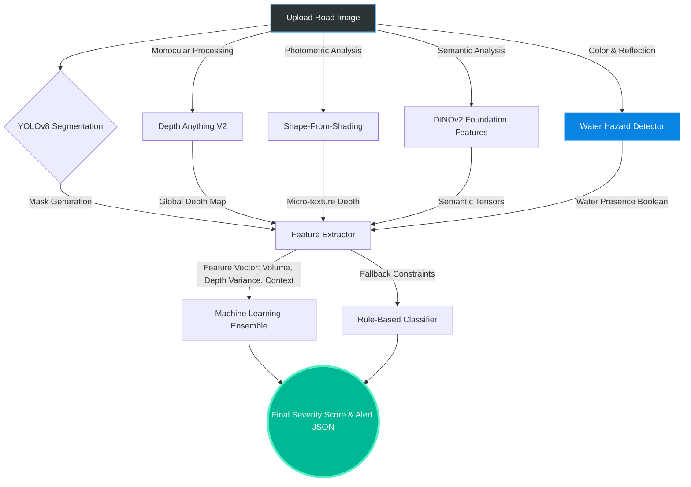

<div align="center">
  

  <h1>🛣️ RoadLens: Advanced Vision-Based Pothole Detection</h1>

  <p>
    <em>A next-generation road hazard analysis stack powered by YOLOv8, Depth-Anything-V2, DINOv2, and Shape-From-Shading.</em>
  </p>

  [](https://www.python.org/)
  [](https://fastapi.tiangolo.com/)
  [](https://react.dev/)
  [](https://docs.ultralytics.com/)
</div>

<hr/>

## ✨ What Makes RoadLens Different?

RoadLens goes far beyond drawing basic bounding boxes around potholes. It builds a comprehensive 3D understanding of the road surface using multi-modal AI pipelines:

* 🌊 **Water Hazard Detection**: Algorithms detect water-filled potholes which pose significantly higher risks to drivers.
* 🕳️ **Pseudo-Depth Profiling**: Combines neural depth networks with photometric **Shape-From-Shading (SFS)** to capture the jagged micro-textures of deep craters.
* 🧠 **Semantic Intelligence (DINOv2)**: Differentiates between actual structural road damage and deceptive flat shadows cast by trees or vehicles.
* ⏱️ **Temporal Degradation Tracking**: Tracks pothole evolution across sequential frames to predict degradation rates over time.

---

## 🏗️ System Architecture


The following diagram illustrates the multi-modal data flow from image upload to final severity classification:



---

## 📊 Visualizing Results

The system is equipped with an interactive **React Bento-Dashboard** that visualizes the results. Internally, the pipeline generates robustness matrices and performance charts.

*(Check the `ml_results/` directory for generated visualizations like the one below, which compares model accuracy across different condition scenarios!)*

> 

---

## 📁 Directory Architecture

```text
RoadLens/
├── api.py                        # FastAPI backend entry point
├── main.py                       # CLI rule-based pipeline
├── inference.py                  # CLI ML-based inference pipeline
├── src/                          # Core & Advanced Algorithms
│   ├── core/                     # YOLO, Features, ML Classifiers
│   └── advanced/                 # SFS, Water Detection, DINOv2
├── tests/                        # Suite of testing and verification scripts
├── ml_models/                    # Trained ML artifacts
├── ml_results/                   # Evaluation results, charts, and metrics
├── scripts/                      # Utility scripts (dataset conversion, etc.)
└── web-ui/                       # React/Vite Frontend Dashboard
```

---

## 🚀 Quick Start Guide

<details>
<summary><strong>1. Environment Setup (Click to expand)</strong></summary>

```powershell
python -m venv .venv
.venv\Scripts\activate
python -m pip install -r requirements.txt
copy .env.example .env
```
</details>

<details>
<summary><strong>2. External Weights & Models</strong></summary>

You must download the foundational models to run local inference:
1. **Depth-Anything-V2**: `git clone https://github.com/DepthAnything/Depth-Anything-V2.git`
2. **Depth Checkpoint**: Place `depth_anything_v2_vits.pth` in `Depth-Anything-V2/checkpoints/`
3. **YOLO Weights**: Place your trained `best.pt` in `yolo-segmentation/model/`
</details>

<details>
<summary><strong>3. Running the Stack</strong></summary>

**Backend:**
```powershell
python api.py
```

**Frontend:**
```powershell
cd web-ui
npm install
npm run dev
```
</details>

---

## 🧪 Testing & Validation

We maintain a rigorous test suite to ensure the pipeline handles diverse road conditions correctly.

Run the end-to-end integration test:
```powershell
python tests/test_pipeline.py
```

Run specific module verifications:
```powershell
python tests/test_water_detection.py
python tests/test_depth_api.py
```

*Results, logs, and visualized outputs from these tests are automatically saved into the `ml_results/` folder for immediate inspection.*
