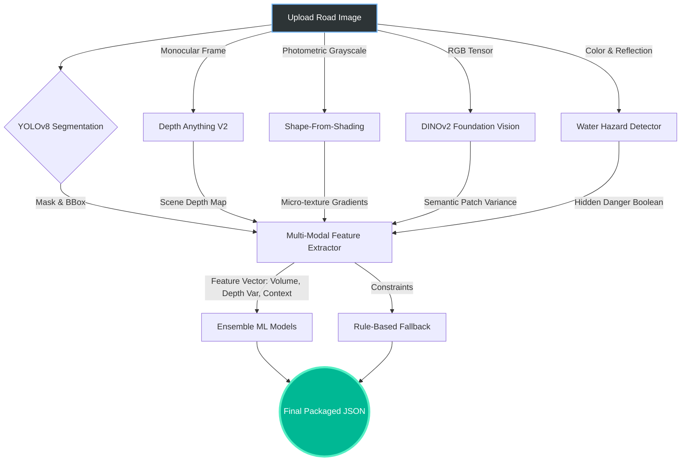
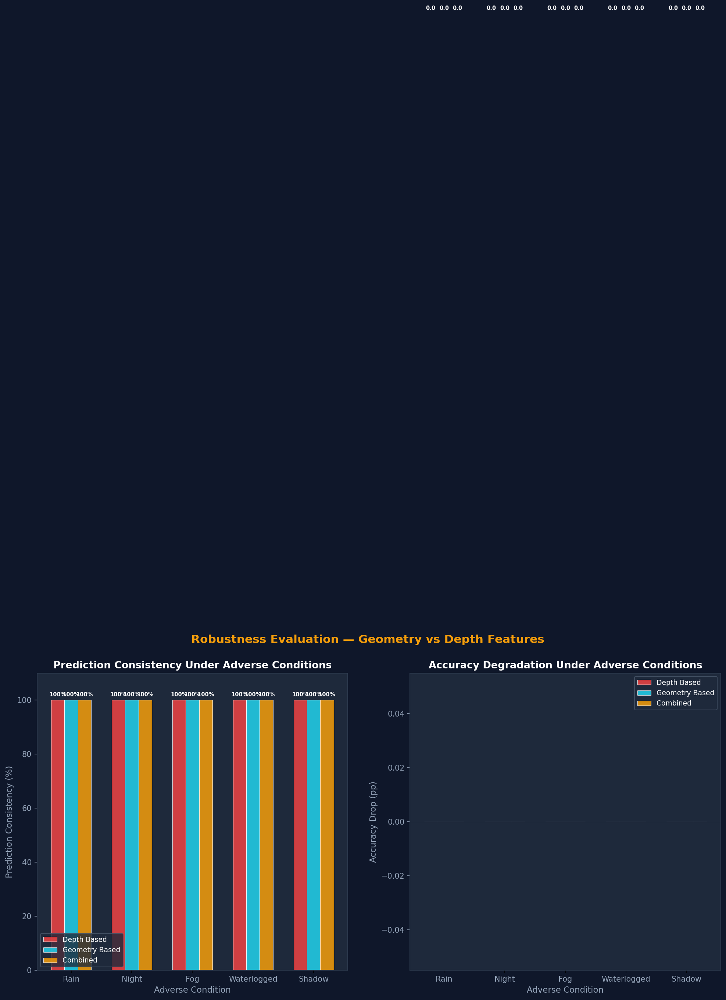

<div align="center">
  

  <h1>🛣️ RoadLens: Advanced Vision-Based Pothole Detection</h1>

  <p>
    <em>A next-generation road hazard analysis stack powered by YOLOv8, Depth-Anything-V2, DINOv2, and Shape-From-Shading.</em>
  </p>

  [](https://www.python.org/)
  [](https://fastapi.tiangolo.com/)
  [](https://react.dev/)
  [](https://docs.ultralytics.com/)
  [](https://scikit-learn.org/)
</div>

<hr/>

## 📖 Abstract

Traditional pothole detection systems rely entirely on bounding boxes, treating 2D pixel anomalies as road damage. **RoadLens** bridges the gap between 2D segmentation and 3D physical reality. By synthesizing monocular depth estimation, photometric shadow analysis, and foundation semantic features, RoadLens accurately categorizes road damage severity, predicts hazard levels, and rejects visual illusions (like shadows or manhole covers) that fool traditional models.

---

## ✨ Core Technological Pillars

RoadLens utilizes four advanced, concurrent pipelines to analyze a single frame:

### 1. 🕳️ Hybrid Depth Profiling (Neural + Photometric)
Global depth estimation models (like Depth-Anything-V2) excel at scene structure but fail to capture the high-frequency micro-textures of potholes. RoadLens combines global depth gradients with **Shape-From-Shading (SFS)**. By calculating surface normals from lighting gradients and integrating them via the Frankot-Chellappa algorithm, the system generates localized, high-resolution pseudo-depth maps of craters.

### 2. 🧠 Semantic Intelligence via DINOv2
Tree shadows on flat roads often trigger false positive "deep" readings in traditional depth networks. To counter this, we integrated **DINOv2 Foundation Features**. The system extracts patch-level feature vectors from the bounding box. High internal variance in these vectors indicates jagged, chaotic textures (true potholes), while low variance indicates a flat surface (shadows/illusions), allowing the system to actively downgrade false severities.

### 3. 🌊 Water Hazard Detection
Submerged potholes disguise their true depth and pose hydroplaning risks. The pipeline uses HSV color thresholding, reflection variance analysis, and contour area checking to determine a **Water Presence Boolean**. If a pothole is classified as filled with water, its severity is mathematically inflated due to the hidden danger.

### 4. ⏱️ Temporal Degradation Tracking
For video feeds or sequential inspections, the `temporal_analysis.py` module tracks individual potholes across frames using Intersection over Union (IoU) and structural similarity (SSIM). It calculates degradation slopes over time, alerting authorities to exponentially worsening road conditions.

---

## 🏗️ System Architecture & Data Flow




---

## 📊 Machine Learning Pipeline & Results

The system extracts a **31-dimensional feature vector** for each segmented pothole. These features are scaled and fed into an ensemble of machine learning classifiers to determine severity (Low, Medium, High).

**Models Evaluated:** Random Forest, XGBoost, SVM, KNN, LightGBM, Logistic Regression, MLP, and Naive Bayes.

> 

*Detailed classification reports, SHAP feature importance graphs, and t-SNE projections are generated automatically and saved to the `ml_results/` directory during training.*

### Datasets Used
RoadLens is trained and validated on a merged dataset combining:
- **RDD2022 (Road Damage Detector)**: Global bounding box dataset.
- **Pothole-600**: High-resolution semantic segmentation masks.

---

## 🌐 REST API Reference

The backend exposes a highly optimized FastAPI service for integration with dashboards or edge devices.

| Method | Endpoint | Description |
|--------|----------|-------------|
| `GET`  | `/healthz` | Confirms the API and ML models are loaded into memory. |
| `POST` | `/analyze` | Main inference endpoint. Accepts `multipart/form-data` image upload. Returns bounding boxes, severity labels, confidence scores, water hazard flags, and Base64 overlay images. |
| `GET`  | `/insights/summary` | Aggregates the latest metrics from the `ml_results/` directory for dashboard charting. |
| `GET`  | `/insights/files/{file}` | Serves artifacts (like SHAP charts) to the frontend. |

---

## 📁 Detailed Directory Structure

```text
RoadLens/
├── api.py                        # FastAPI endpoints and route handlers
├── main.py                       # CLI interface for standard processing
├── inference.py                  # Headless inference for batch scripts
├── src/                          
│   ├── core/                     # YOLO handling, Geometry extraction, ML parsing
│   └── advanced/                 # SFS math, DINOv2 tensors, Water reflections
├── tests/                        # PyTest/Unittest scripts (API, Water, Flow)
├── ml_models/                    # Serialized .pkl files (Scalers, RandomForests)
├── ml_results/                   # Auto-generated PDF reports and PNG charts
├── docs/                         # Vector assets, architectural plans, diagrams
├── scripts/                      # Dataset ingestion (RDD2022/Pothole600 converters)
└── web-ui/                       # React/Vite Frontend (Bento-Grid Dashboard)
```

---

## 🚀 Installation & Setup

<details>
<summary><strong>1. Python Environment (Click to expand)</strong></summary>

We highly recommend using a virtual environment to prevent dependency conflicts.
```powershell
python -m venv .venv
.venv\Scripts\activate
python -m pip install --upgrade pip
python -m pip install -r requirements.txt
copy .env.example .env
```
</details>

<details>
<summary><strong>2. Downloading Foundation Weights</strong></summary>

Due to GitHub file limits, large models must be downloaded locally:
1. **Depth-Anything-V2 Repository**: 
   ```powershell
   git clone https://github.com/DepthAnything/Depth-Anything-V2.git
   ```
2. **Depth Checkpoint**: Download the `vits` checkpoint from the official Depth-Anything-V2 releases and place it at: `Depth-Anything-V2/checkpoints/depth_anything_v2_vits.pth`
3. **YOLOv8 Custom Weights**: Place your trained segmentation model at `yolo-segmentation/model/best.pt`
</details>

<details>
<summary><strong>3. Web UI Setup</strong></summary>

```powershell
cd web-ui
copy .env.example .env
npm install
```
Ensure your `web-ui/.env` contains `VITE_API_BASE_URL=http://localhost:8000`.
</details>

---

## ⚙️ Running & Testing

**Run the Backend Server:**
```powershell
python api.py
```

**Run the React Dashboard:**
```powershell
cd web-ui
npm run dev
```

**Run Automated Verification Tests:**
```powershell
# Runs the full end-to-end processing pipeline on test images
python tests/test_pipeline.py

# Runs specific sub-module checks
python tests/test_water_detection.py
```
